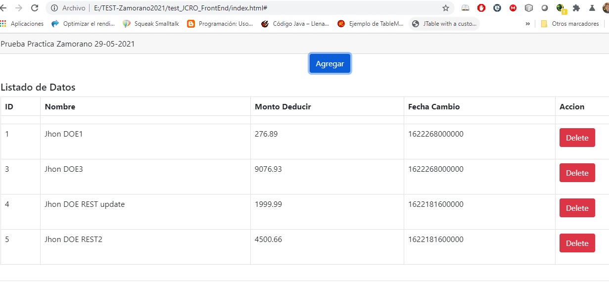
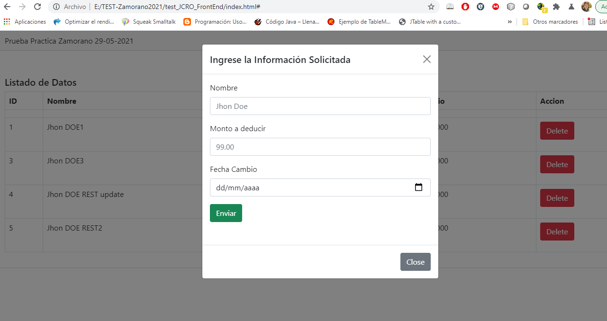

# test_JCRO_FrontEnd
Prueba FrontEnd Zamorano
-Costa de un solo archivo index.html
-Aqui se encuentra todo el codigo para enviar la informacion al Microservicio.
-Se recomienda cambiar la variable urlServer con respecto al puerto y nombre del servidor.

